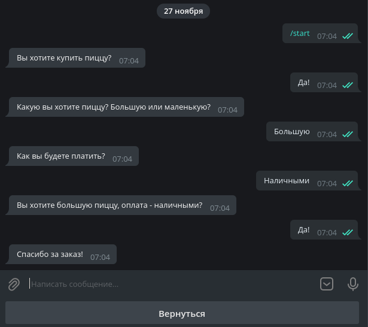

# Pizza TG Bot

This's a simple chatbot that uses a state machine to order pizza.



## Contents:

* [Settings](#settings)

## Settings:

1. Add local settings to src/tg/config/local_settings.py:

    ```python
    import logging

    LOGGING_LEVEL = logging.INFO

    TOKEN = <TOKEN>
    ```

## Contacts:

Created by [@stonedch](https://github.com/stonedch)
